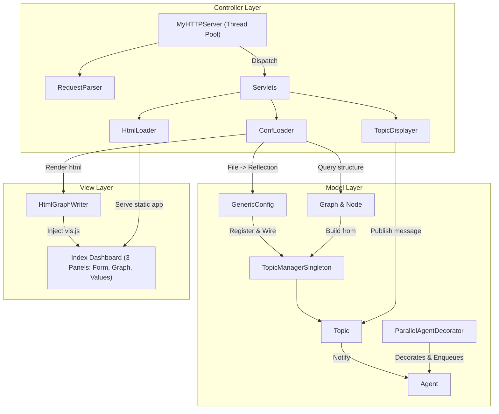
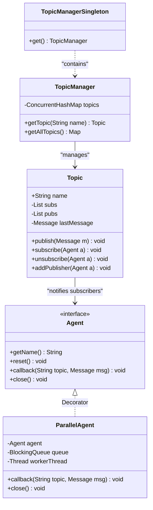
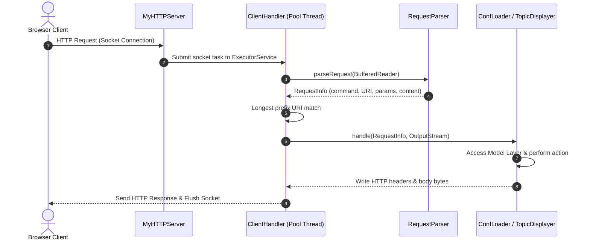
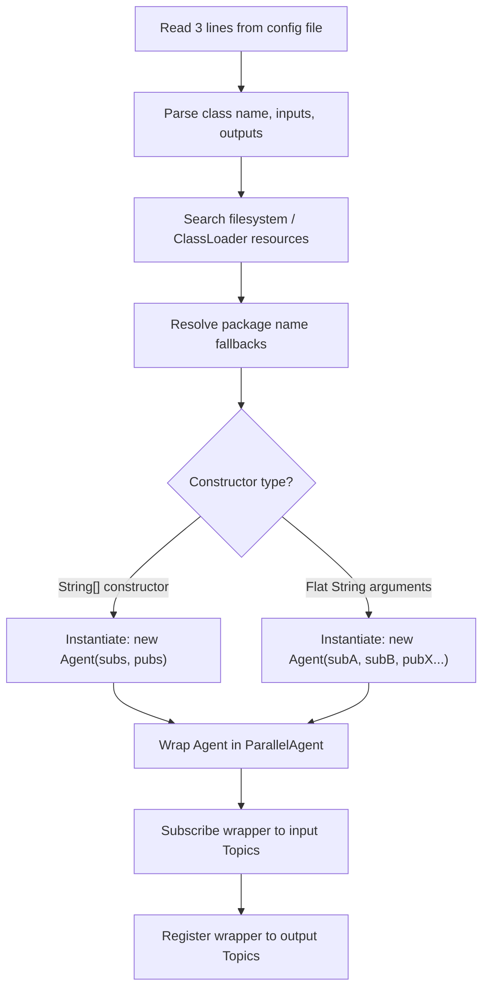
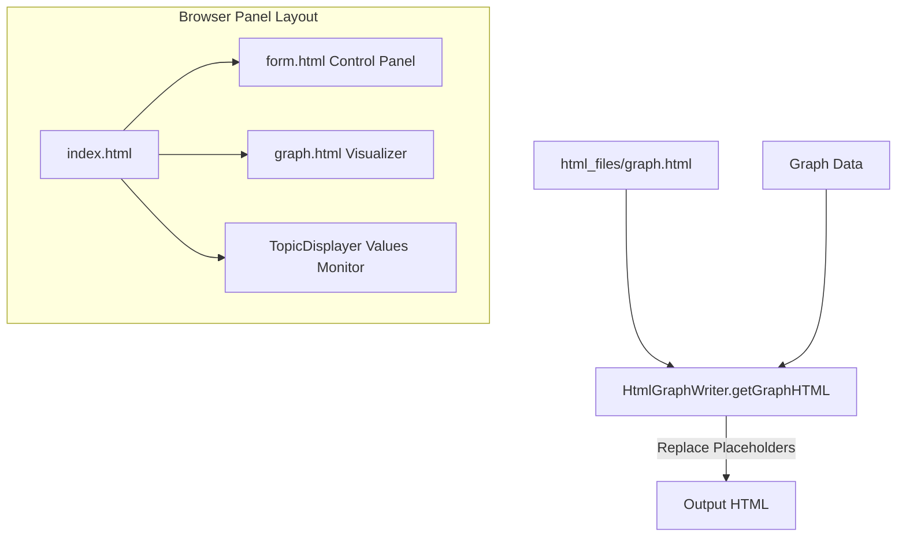

# Computational Graph Dashboard — Design Document

This design document outlines the architecture, data structures, and implementation details of the **Computational Graph Dashboard**, an embeddable multi-threaded HTTP server and dynamic pub-sub computational graph engine built using Java 17+.

---

## 1. Architectural Overview

The system is structured according to the **Model-View-Controller (MVC)** architectural pattern, separating the application logic (computational graph), HTTP delivery mechanism (server and servlets), and interactive dashboard layout (HTML files and Vis.js views).



### MVC Layer Responsibilities
*   **Model**: Represents the core domain. This contains the pub-sub engine (`Topic`, `TopicManagerSingleton`), the execution nodes (`Agent`, `ParallelAgent`, `Message`), the reflection config loader (`GenericConfig`, `Config`), and the graph layout structure (`Graph`, `Node`).
*   **Controller**: Binds incoming client requests to model interactions. The `MyHTTPServer` uses a thread pool to handle concurrent sockets. It routes requests via longest prefix matching to concrete `Servlet` instances (`HtmlLoader`, `ConfLoader`, and `TopicDisplayer`).
*   **View**: Formats models for rendering. The `HtmlGraphWriter` binds the bipartite computational graph model into an interactive Vis.js HTML visualization. The frontend uses a three-frame dashboard layout (`index.html`, `form.html`, `graph.html`) styling with custom dark-mode aesthetics.

---

## 2. Model Layer: Pub-Sub Graph Engine

The computational engine handles streaming values across a directed bipartite graph. Nodes are either **Topics** (data holders) or **Agents** (computational processors).



### Core Components

#### A. Topic (`graph.Topic`)
A named pub-sub communication channel.
*   **Fields**:
    *   `name` (String): Unique channel name.
    *   `subs` (List<Agent>): Subscribed agents notified when messages arrive.
    *   `pubs` (List<Agent>): Registered publishing agents (used primarily for graph topology rendering).
    *   `lastMessage` (volatile Message): Caches the latest value published on this topic.
*   **Message Delivery**: The `publish(Message m)` method updates `lastMessage` and synchronously notifies all registered subscribers by executing their `callback` methods in the caller's thread context.

#### B. Agent (`graph.Agent`)
The functional interface for processing nodes.
*   **Lifecycle Methods**:
    *   `getName()`: Returns the unique identifier of the agent.
    *   `reset()`: Resets any internal accumulated state between calculation runs.
    *   `callback(String topic, Message msg)`: Invoked when a subscribed topic publishes a new value.
    *   `close()`: Releases subscriptions and internal resources.
*   **Implementations**:
    *   `PlusAgent`: Accumulates numeric values from two inputs, publishing their sum to an output topic when both are present.
    *   `IncAgent`: Increments a single numeric input value by 1 and publishes to an output topic.
    *   `BinOpAgent`: A generic two-input binary operator agent (e.g. addition, subtraction, multiplication) that automatically registers itself with input and output topics in its constructor.

#### C. ParallelAgent (`graph.ParallelAgent`)
A decorator implementation of `Agent` that shifts callback execution to a background worker thread.
*   **Asynchronous Processing**: Uses a thread-safe, bounded `ArrayBlockingQueue<TopicMessage>` (capacity default: 10) to store incoming messages.
*   **Worker Thread**: A dedicated, continuous worker thread polls the queue using `.take()` (which blocks cleanly when empty, consuming no CPU cycles) and dispatches messages to the wrapped agent's `callback`.
*   **Thread Safety**: Enqueuing messages via `put()` blocks the publisher thread if the queue is full, preventing memory overflow. The single worker thread ensures that the delegate agent's `callback` is executed sequentially, avoiding race conditions on the agent's internal state.

#### D. TopicManager (`graph.TopicManagerSingleton.TopicManager`)
A thread-safe registry of all active topics.
*   **Storage**: Internally backed by a `ConcurrentHashMap<String, Topic>`.
*   **Retrieval**: `getTopic(String name)` retrieves a topic by name, or initializes it on-the-fly via `computeIfAbsent` if it does not yet exist.

---

## 3. Controller Layer: HTTP Server & Web Servlets

The Controller Layer manages network connections, parses incoming HTTP payloads, and dispatches requests to dedicated handler servlets.



### Network Architecture

#### A. MyHTTPServer (`server.MyHTTPServer`)
A multi-threaded server implementation using Java's standard socket API.
*   **Concurrency**: Backed by a fixed thread pool (`ExecutorService`) configured to handle up to `n` concurrent client connections.
*   **Accept Loop**: Binds a `ServerSocket` and runs inside a dedicated server thread. It uses a socket timeout of 1 second so that it can check the status of the `isRunning` flag regularly and support graceful termination.
*   **Request Dispatching**: Hands each accepted client socket off to a `ClientHandler` runnable and submits it to the thread pool.
*   **Routing Logic**:
    1.  Strips any query parameters from the request URI path.
    2.  Locates the target servlet mapping map corresponding to the HTTP method (`GET`, `POST`, or `DELETE`).
    3.  Performs a **longest prefix match** search against the registered URI path prefixes.
    4.  If a match is found, invokes the servlet's `handle` method; otherwise, writes `404 Not Found` or `405 Method Not Allowed`.

#### B. RequestParser (`server.RequestParser`)
A stateless parsing engine that extracts structured details from incoming HTTP request streams.
*   **Parsing Steps**:
    1.  Reads the initial Request Line to capture the HTTP Command (Method) and full URI.
    2.  Segments the URI path into an array of path segments (`getUriSegments()`).
    3.  Extracts query string parameters (pairs split by `&` and `=`).
    4.  Reads headers line-by-line, watching for `Content-Length` and `Host` values.
*   **Dynamic Parsing Modes**:
    *   *Standard HTTP mode*: Reads exactly `Content-Length` bytes from the stream for the body payload.
    *   *Course/Test mode*: Activated if `Host` is `example.com` or `Content-Length` is exactly `5`. In this mode, it parses `key=value` configuration lines directly following headers until an empty line, and reads the remaining text as the body.

### Web Servlets

All servlets implement the `servlets.Servlet` interface.

```java
public interface Servlet {
    void handle(RequestParser.RequestInfo ri, OutputStream toClient) throws IOException;
    void close() throws IOException;
}
```

*   **HtmlLoader**: Serves static frontend resources (HTML, CSS, JS, images) from a root folder (`html_files/`). It determines the `Content-Type` headers based on file extensions.
*   **ConfLoader**: Serves the configuration upload dashboard.
    *   **GET**: Rebuilds the graph from current topics and writes the dynamic HTML visualization.
    *   **POST**: Parses multipart/form-data containing configuration details, saves them locally in the `config_files/` directory, compiles the new pipeline using `GenericConfig`, and renders the visual graph.
*   **TopicDisplayer**: Processes message publishing.
    *   **Action**: Extracts `topic` and `message` parameters. If present, publishes the value to the pub-sub engine.
    *   **Response**: Renders a dynamic HTML table showing the names and values of all registered topics, sorted alphabetically.

---

## 4. Configuration & Reflection Layer

The configuration module manages runtime instantiation and wiring of computational graph pipelines.

### Configuration File Format
Configuration files (e.g. `simple.conf`) define agents in three-line blocks:
1.  **Line 1**: The fully qualified Java class name of the agent (e.g., `project_biu.configs.PlusAgent`).
2.  **Line 2**: Comma-separated names of input topics (subscriptions).
3.  **Line 3**: Comma-separated names of output topics (publications).

### Reflective Classloading
`GenericConfig` loads classes at runtime using reflection.



*   **Package Name Resolution**: To support compatibility with various test frameworks, the class loader tests multiple package candidate prefixes (`configs.*`, `test.*`, `project_biu.configs.*`) during class resolution.
*   **Constructor Injection**: The loader queries the constructor types of the target agent class, matching either:
    1.  An `Agent(String[] subs, String[] pubs)` constructor (e.g. `PlusAgent`, `IncAgent`).
    2.  A flat constructor mapping arguments sequentially: `Agent(String sub1, String sub2, ... String pub1, ...)`.

---

## 5. Bipartite Graph Modeling & Cycle Detection

The computational graph is modeled as a directed bipartite graph where edges exist exclusively between `Topic` nodes and `Agent` nodes.

```mermaid
graph LR
    TA[Topic A] --> PlusAgent[PlusAgent]
    TB[Topic B] --> PlusAgent
    PlusAgent --> TC[Topic C]
    TC --> IncAgent[IncAgent]
    IncAgent --> TD[Topic D]
    
    style TA fill:#1e293b,stroke:#3b82f6,stroke-width:2px;
    style TB fill:#1e293b,stroke:#3b82f6,stroke-width:2px;
    style TC fill:#1e293b,stroke:#3b82f6,stroke-width:2px;
    style TD fill:#1e293b,stroke:#3b82f6,stroke-width:2px;
    
    style PlusAgent fill:#064e3b,stroke:#10b981,stroke-width:2px;
    style IncAgent fill:#064e3b,stroke:#10b981,stroke-width:2px;
```



### Graph Structures

#### Node (`configs.Node`)
Represents a vertex in the graph.
*   **Fields**:
    *   `name` (String): If representing a Topic, name is prefixed with `T` (e.g. `TA`). If representing an Agent, name corresponds to the agent's class name (e.g. `PlusAgent`).
    *   `edges` (List<Node>): Directed edges originating from this node.
    *   `msg` (Message): Holds the message data for display.
*   **Cycle Detection**: Implements a localized DFS using recursion-stack tracking to determine if cycles are reachable from this vertex.

#### Graph (`configs.Graph`)
A subclass of `ArrayList<Node>` managing the collective network structure.
*   **Generation**: `createFromTopics()` gathers the list of all registered topics from `TopicManagerSingleton`. It populates topic nodes, agent nodes, and directed edges mapping to subscriptions (Topic -> Agent) and publishers (Agent -> Topic).
*   **Cycle Detection**: `hasCycles()` performs a graph-wide **three-color DFS** algorithm:
    *   `0` (Unvisited): Node has not been touched yet.
    *   `1` (Visiting): Node is on the current DFS recursion stack. If encountered again, a cycle exists.
    *   `2` (Completed): Node and all its descendants have been fully evaluated.

---

## 6. Visualization & View Layer

The View Layer renders the computational graph dynamically using Vis.js.



### The HtmlGraphWriter (`views.HtmlGraphWriter`)
Generates the visualization markup.
*   **Template Loading**: Reads `html_files/graph.html`. If the template file is missing, it falls back to a built-in default template string.
*   **Data Injection**: Translates the Java `Graph` structure into native JavaScript object arrays representing nodes and edges, inserting them into the template's `/* INJECT_GRAPH_DATA_HERE */` placeholder:
    *   Topic nodes display their current value in brackets, for example: `A [ 5.0 ]`.
    *   Agent nodes are colored green, and Topic nodes are colored slate blue.
*   **Reload Synchronization**: Automatically appends a client-side JavaScript frame-reload trigger:
    ```javascript
    if (window.parent && window.parent.frames['values-right']) {
        window.parent.frames['values-right'].location.href = 'http://localhost:8080/publish';
    }
    ```
    This ensures that when a new configuration is uploaded, the topic values table automatically refreshes to match. Similarly, when new values are published, the table reloads the graph frame to update labels.

---

## 7. Design Pattern & SOLID Principles Analysis

The application enforces software design quality metrics by applying SOLID principles:

| Principle | Codebase Implementation Detail |
| :--- | :--- |
| **Single Responsibility (SRP)** | Class responsibilities are isolated. `RequestParser` only handles raw HTTP byte streams; `HtmlGraphWriter` only manages vis.js string serialization; `MyHTTPServer` handles sockets. |
| **Open/Closed (OCP)** | The graph engine is open to extension. Developers can write new agents by implementing the `Agent` interface. Reflection-based class loading loads them dynamically without modifying `GenericConfig` or the graph core. |
| **Liskov Substitution (LSP)** | `ParallelAgent` implements the `Agent` interface, acting as a decorator. It can wrap and replace any concrete agent subtype (e.g. `PlusAgent`, `IncAgent`) without altering message distribution pipelines. |
| **Interface Segregation (ISP)** | Module boundaries are defined by small interfaces. Clients implement `Servlet` to add web handlers or `Config` to load models, without depending on unused methods. |
| **Dependency Inversion (DIP)** | The execution pipeline communicates via abstractions. `Topic` handles a list of `Agent` interface objects, and `MyHTTPServer` maps path patterns to `Servlet` interfaces rather than concrete subclasses. |

---

## 8. Build, Execution & Testing Guide

The system includes tools to compile and deploy the server.

### 1. Build Compilation
The project can be built using IDE build systems or compiled directly via terminal scripts.

*   **Command Line Compilation (Windows/PowerShell)**:
    ```powershell
    # Create target directory
    mkdir -Force out/production/Advanced_Programming_Project

    # Gather source files and compile
    Get-ChildItem -Recurse -Filter *.java | Select-Object -ExpandProperty FullName | Out-File -FilePath java_sources.txt -Encoding utf8
    javac -d out/production/Advanced_Programming_Project -sourcepath ".;configs/src;graph/src;server/src;servlets/src;views/src" $java_sources.txt
    Remove-Item java_sources.txt
    ```

### 2. Execution
Start the HTTP server by executing:
```bash
./run.bat
```
This runs `Main.java`, opening a port on `8080` with a pool of 5 connections and registers the default HTTP endpoints.

### 3. Verification Workflow
1.  Navigate to `http://localhost:8080/app/index.html`.
2.  In the Control Panel, choose a configuration file (e.g. `config_files/simple.conf`) and click **Deploy**.
3.  The central panel renders the interactive bipartite graph.
4.  Publish values (e.g. topic `A` = `10.0`, `B` = `5.0`). The system computes values and updates the dashboard view to display `C [ 15.0 ]` and `D [ 16.0 ]`.
